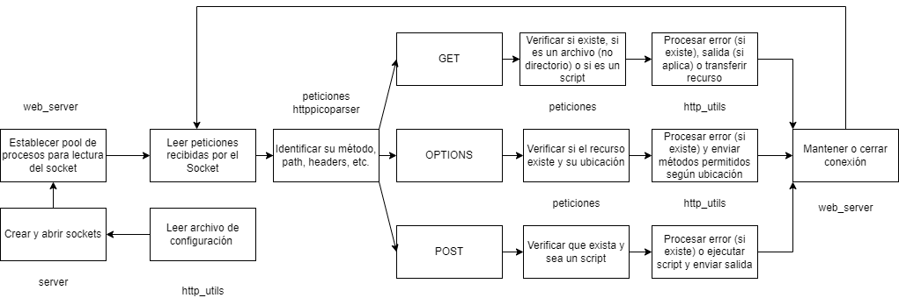

# Requisitos funcionales
1. El servidor será capaz de recibir y procesar peticiones HTTP.
2. El servidor será capaz de enviar respuestas HTTP a las peticiones correspondientes.
3. El servidor será capaz de procesar peticiones del verbo GET para obtención de recursos (imágenes, textos, archivos html, multimedia)
4. El servidor será capaz de procesar peticiones del verbo POST para la ejecución de scripts 
5. El servidor será capaz de procesar scripts tanto del lenguaje Python y PHP, ejecutando el intérprete correspondiente y devolviendo su salida en texto plano hasta “\r\n”
6. Las variables de entrada para los scripts que el servidor ejecutará serán el Body, en caso de POST y los query parameters en caso del verbo GET, los cuales serán debidamente procesador dentro del contenido del script.
7. El servidor será capaz de procesar el verbo OPTIONS tanto para recursos en específico como para el servidor raíz, contestando en su respuesta en la cabecera “Allow” los verbos soportados según sea el caso.
8. El servidor será capaz de manejar múltiples conexiones simultáneas, atendiendo múltiples clientes a la vez.
9. En caso de que se haga una petición HTTP a un recurso no existente, el servidor retornará una respuesta 404 Not Found.
10. En caso de que se haga una petición HTTP con un verbo no soportado (DELETE, PUT, OPTIONS) el servidor retornará una respuesta 405 Method Not Allowed
11. El servidor será capaz de mantener abierta una misma conexión establecida con un cliente 
12. Las respuestas del servidor incluirán las cabeceras correspondientes de forma correcta, como lo son Content-Type, Date, Server, Content-Length, y Connection.
13. El servidor no permitirá el listado de directorios mediante el verbo GET, contestando con una respuesta 403 Forbidden.
14. El puerto en que se ejecuta el servidor, el nombre del servidor, los máximos clientes esperando en la cola de peticiones y el directorio raíz de los recursos del servidor deberán ser debidamente especificados en el archivo de configuración siguiente el formato “clave = valor”
15. En caso de que el archivo de configuración no sea encontrado o que las claves no sean especificadas, se usarán valores por defecto,

# Requisitos no funcionales
1. Se requiere de una versión mínima de C99 para compilar y ejecutar el proyecto
2. El servidor HTTP debe ejecutarse en una máquina con sistema operativo Linux
3. A pesar de que no es completamente necesario, se requiere de estar conectado a internet para que el servidor pueda ser accedido remotamente dentro de la misma red.
4. Se requiere de un espacio en disco mínimo de 200MB para guardar el código fuente, ejecutables y los recursos del servidor

# Diagrama de funcionamiento
El servidor HTTP en su forma más general sigue este procesamiento:
1. Crear sockets que permitan la conexión de clientes al servidor
2. Crear una pool de procesos para manejar las conexiones entrantes al servidor
3. Para cada conexión entrante, se leen las peticiones entrantes hasta que no exista más contenido que leer o el cliente cierre la conexión
4. Para cada petición, se leen los headers, verbo y path (usando la librería `httppicoparser`)
5. Se verifica que exista el recurso o URL (si no, se procesa una respuesta 404) y que el método sea válido (si no, se procesa una respueta 405)
6. Dependiendo el método, se verifica si el recurso es una ruta o un recurso, solo la petición OPTIONS permite acceso a rutas
7. Para la petición GET, se transmite el binario del archivo en cuestión o se ejecuta el script en cuestión con los query params como variables
8. Para la petición POST, se ejecuta el script en cuestión con el body como variables
9. Para la petición OPTIONS, se envían los métodos autorizados para el path o recurso. Solamente el servidor en general, los recursos scripts o los scripts permiten POST
10. Se envía la petición, enviando los headers correspondientes y se repite el paso 3

Este proceso se puede ver en el diagrama en cuestión:

# Casos de uso
En general, se describen los posibles usos del servidor
## Manejo de peticiones de usuarios

## Peticion GET

## Peticion POST

## Peticion OPTIONS

## Otras peticiones
