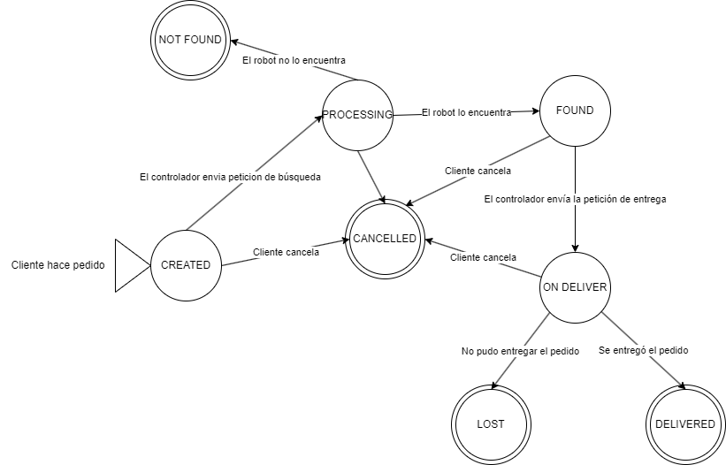
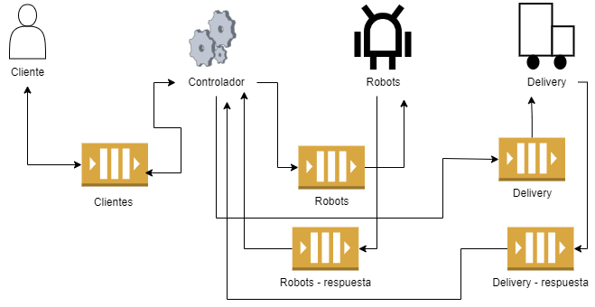
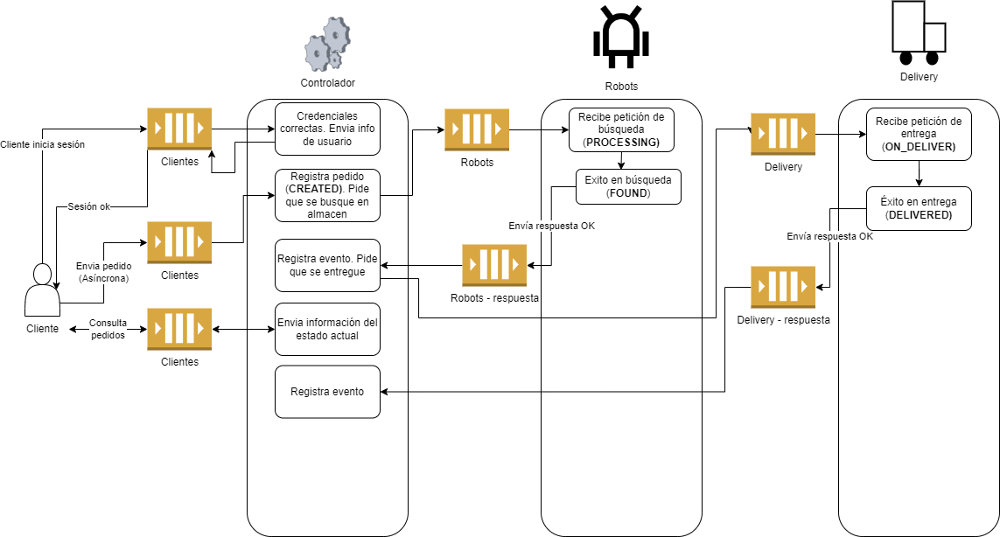
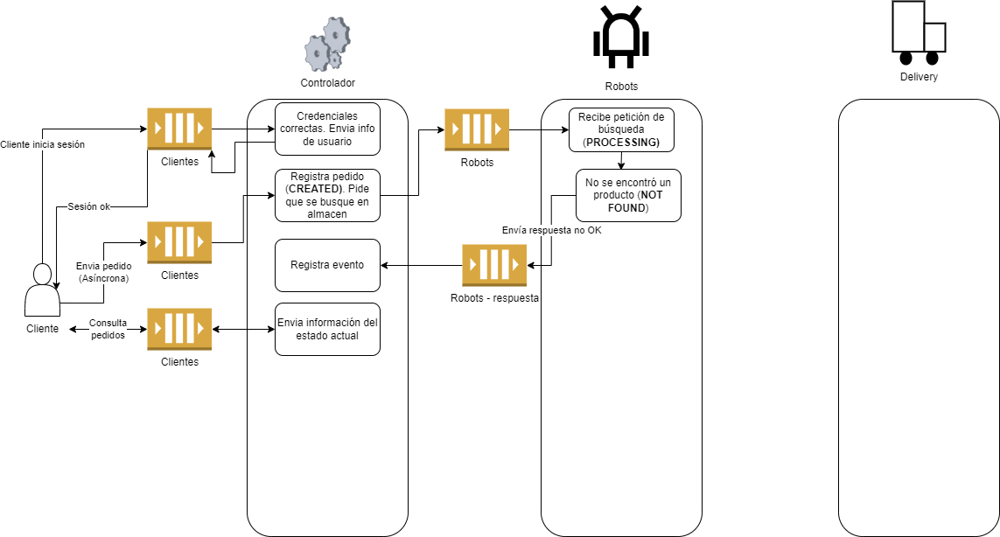
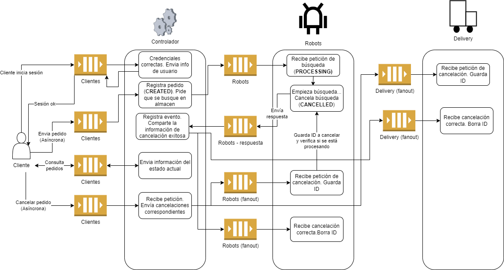
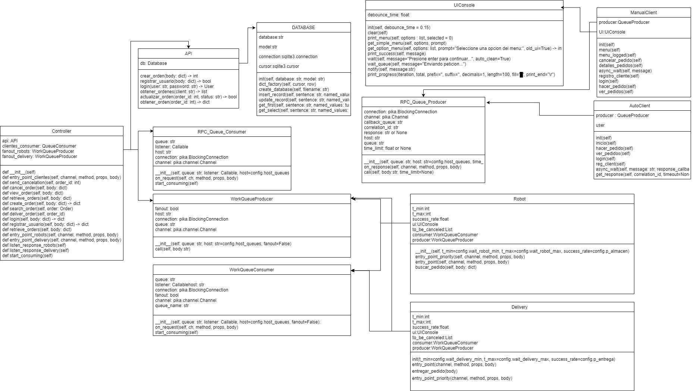

# 3. Implementación (Desarrollo técnico)
Una vez definidos los requerimientos del sistema, la solución propuesta empleada se describe en las siguientes secciones de forma general.

## 3.1 Diagrama de estados de pedido

## 3.2 Descripción de las colas de mensajes empleadas
En nuestro diseño, los actores se comunican mediante las siguientes colas:

Donde cada actor funciona de la siguiente manera:

* **Clientes**: Esta cola funciona para que el cliente pueda generar mensajes (productor) que el controlador procese (consumidor), y es tipo RPC, ya que en algunas ocasiones el cliente debe esperar una respuesta antes de proseguir (por ejemplo, en login). Para otros casos, como registro, se sigue haciendo uso de esta cola, pero haciendo una espera asíncrona.
* **Robots**: Esta cola funciona para enviar mensajes a los robots. En el estilo de Cola de Trabajo simplemente coloca los mensajes y el primero en estar disponible los recibe, permitiendo dividir el trabajo entre múltiples entidades. En modo fanout, todos los robots recibirán el mensaje, esto es útil para cancelaciones, y al ser una cola diferente, no hay problema de prioridades. Estas dos colas podrían considerarse como “diferentes”, ya que usan distintos mecanismos cada uno.
* **Robots - respuesta**: Cola exclusiva para actualizar del estado final de la tarea al controlador, ya que de otra manera el cliente tendría que esperar a que el robot termine su trabajo para actualizar estados y proseguir, o en peores casos, perder información en caso de que el controlador muera mientras se está procesando el pedido, el cual ya tiene un estado final y si el mensaje de respuesta falla su entrega, tendría que repetir todo.
* **Delivery**: Esta cola funciona similar al de robots, para enviar mensajes a los repartidores. En el estilo de Cola de Trabajo simplemente coloca los mensajes y el primero en estar disponible los recibe, permitiendo dividir el trabajo entre múltiples entidades. En modo fanout, todos los repartidores recibirán el mensaje, esto es útil para cancelaciones, y al ser una cola diferente, no hay problema de prioridades. Estas dos colas podrían considerarse como “diferentes”, ya que usan distintos mecanismos cada uno.
* **Delivery - respuesta**: Cola exclusiva para actualizar del estado final de la tarea al controlador, ya que de otra manera el cliente tendría que esperar a que el repartidor termine su trabajo para actualizar estados y proseguir, o en peores casos, perder información en caso de que el controlador muera mientras se está procesando el pedido, el cual ya tiene un estado final y si el mensaje de respuesta falla su entrega, tendría que repetir todo.

## 3.3 Diagrama de casos de uso 
Se describen tres casos de uso específicos, los cuales toman en cuenta diferentes escenarios en donde el resultado del pedido varía, ya sea por cuestiones internas (probabilidad) o externas (cancelación por usuario)

### 3.3.1 Pedido completado hasta el final

### 3.3.2 Pedido en el que el robot no encunetra el producto

### 3.3.3 Pedido que se cancela antes de empezar el reparto

## 3.4 Flujo lógico
El flujo de la aplicación, a pesar de ser lineal, no es necesariamente ejecutado secuencialmente en una sola línea de tiempo síncrona, es decir, puede que ciertas porciones se ejecuten de forma continua, pero en algunas haya que esperar un poco a ser ejecutadas, esto porque son ejecutadas de forma síncrona.
Dependiendo de la petición, más o menos actores son involucrados, pero en un caso general de un pedido, se sigue este flujo:
1. El cliente hace una petición de crear un pedido (puede ser registrarse, ver pedidos, etc.)
2. El controlador recibe las peticiones del cliente y las procesa según sea el caso, si fuera login o registro este mismo solamente responde, pero si fuera un pedido, se actualiza la base de datos y se envía el pedido a búsqueda a los robots
3. Los robots reciben la solicitud de búsqueda, la cual empiezan a procesar. Al momento de tener un resultado (éxito o fracaso), comunican este al controlador
4. El controlador recibe dicha respuesta, y según sea el caso actualiza el estado y además comunica al repartidor, si fuera exitoso 
5. El repartidor recibe el mensaje, lo proceso, y sea cual sea su respuesta, la comunica al controlador
6. El controlador recibe dicha respuesta y actualiza en la base de datos.
7. Cabe mencionar que en cualquier momento el usuario puede cancelar el pedido (otra cosa diferente es que este sea cancelado exitosamente) y además consultar los pedidos.

## 3.5 Formato y sintaxis de mensajes
Para que los actores puedan comunicarse entre sí, es de vital importancia que se compartan mensajes, pero estos deben tener un formato específico, ya que, dependiendo lo que se quiera hacer (crear pedido, hacer orden, etc.), también varía el contenido que se envía. 
Para solucionar esto, se implementaron los siguientes mensajes:

### 3.5.1 Mensajes de petición (Request)
Tanto para clientes, el controlador, robots y delivery. Usan formato JSON, siguiendo esta sintaxis:

    {
    	“subject”: “strings definidos en Enum”,
    	“body”: “{“diccionario” : “parseado a string”}”
    }

En donde subject determina el tipo de petición a realizar y el body contiene todo lo necesario para procesarlo, por ejemplo, el contenido de una orden, de un usuario, o un ID.

### 3.5.2 Mensajes de respuesta (Response)
Implementado para enviar mensajes de confirmación o, por ejemplo, en el caso de los clientes, recibir los detalles de pedidos, datos del usuario, etc.

    {
	    “status”: “strings definidos en Enum ”,
	    “message”: “Mensaje adicional, opcional”,
	    “body”: “{“diccionario” : “parseado a string”}”
    }

En donde “status” determina el si hubo éxito o no en la petición, message proporciona datos adicionales del estado y el body contiene información útil sobre la petición, por ejemplo, la lista de pedidos (si se pidieron) o el contenido de un pedido..

## 3.6 Descripción de mensajes
En el punto anterior se mencionan Enums para diferencias entre mensajes y respuestas. A continuación se explican los posibles mensajes de respuesta y las posibles respuestas

### 3.6.1 Tipos de mensajes
Como se vió, los mensajes dentro del sistema siguen un formato único para peticiones y otro para respuestas, los cuales están en formato JSON y requieren de un parseo previo a envío y posterior a recepción. 
Tal y como se explica, las peticiones tienen un subject o asunto, el cual puede ser cualquiera de los siguientes, y su body es el siguiente:
* **REGISTRO**: Mensaje de cliente a controlador para registro de un usuario
    * Body: Username, name, password
* **LOGIN**: Mensaje de cliente a controlador de inicio de sesión de un usuario 
    * Body: Username, password
* **CREATE_ORDER**: Mensaje de cliente a controlador para crear una orden
    * Body: ID, description, total, client
* **SEARCH_ORDER**: Mensaje de controlador a robot para buscar clientes
    * Body: Orden
* **VIEW_ORDERS**: Mensaje de cliente a controlador para listar órdenes de un usuario
    * Body: Cliente
* **DELIVER_ORDER**: Mensaje de controlador a repartidor para entregar pedido
    * Body: Orden
* **CANCEL_ORDER**: Mensaje de cliente a controlador para cancelar una orden 
    * Body: Orden
* **ORDER_FOUND**: Mensaje de robot a controlador para avisar que los artículos fueron encontrados
    * Body: Orden
* **ORDER_NOT_FOUND**: Mensaje de robot a controlador para avisar que los artículos no fueron encontrados
    * Body: Orden
* **ORDER_DELIVERED**: Mensaje de repartidor a controlador para avisar que el pedido fue entregado
    * Body: Orden
* **ORDER_LOST**: Mensaje de repartidor a controlador para avisar que el pedido no pudo ser entregado
    * Body: Orden
* **ORDER_CANCELED**: Mensaje de repartidor o robot al controlador para avisar que el pedido fue correctamente descartado
    * Body: Orden
* **VIEW_ORDER**: Mensaje de cliente a controlador para solicitar los detalles de un pedido
    * Body: Orden (ID)
* **CLEAR_CANCELATION**: Mensaje de cliente a robot y repartidor para avisar que un pedido fue correctamente cancelado y por lo tanto pueden dejar de tomarlo en cuenta
    * Body: Orden (ID)
* **ON_DELIVER**: Mensaje de repartidor a robot para indicar que ha comenzado el reparto
    * Body: Orden

### 3.6.2 Tipos de respuestas
Y, para las respuestas, en general el body contiene el contenido solicitado, el message es solo informativo (y puede estar vacío, en cuyo caso se recibe un string vacío), pero el estado puede ser:
* **ERROR**: La solicitud no pudo ser concretada con éxito, es decir, hubo un login incorrecto o no se pudo crear la orden, por ejemplo.
* **OK**: La solicitud fue realizada con éxito
* **MALFORMED**: La solicitud no pudo ser procesada por error del cliente, es decir, no está en formato adecuado.

## 3.7 Diagrama de clases
Las clases desarrolladas en la solución son las siguientes:

## 3.8 Desarrollo
En resumen, durante el desarrollo del proyecto, se optó en primera instancia por utilizar el sistema de colas de mensajes para enviar y recibir mensajes básicos. Posteriormente, se desarrolló en paralelo la gestión de las bases de datos, el controlador y una interfaz de línea de comandos para el cliente. A medida que se avanzaba en el proyecto, se logró implementar un sistema funcional de registro de usuarios, inicio de sesión y generación de órdenes de compra, sin embargo, estas órdenes no eran procesadas adecuadamente.
Con el objetivo de solucionar esta situación, se procedió a desarrollar una primera versión de los programas de robots y delivery para que las órdenes fueran procesadas correctamente y entregadas a los clientes. A medida que se avanzaba en el proyecto, se identificaron diferentes matices y problemas, como el control de errores del sistema, la cancelación de pedidos y la elaboración más profunda del sistema de cliente manual.
Finalmente, se resolvieron estas dificultades hasta lograr un sistema de comercio electrónico completamente funcional. Posteriormente, se implementó el "cliente automático": launch_client. Con esto, se dio por concluido el desarrollo del proyecto.
